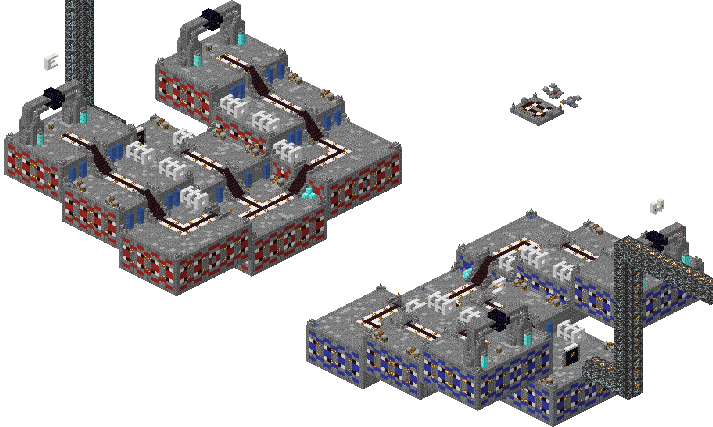

# mciso

mciso renders Minecraft Anvil worlds from versions 1.8 onward. For each map, it writes
four cropped isometric views and corresponding thumbnails.



A full batch over the CommunityMaps, PublicMaps, and PrivateMaps repos - 2,457 maps,
including every `map.xml` variant - renders in about 100 seconds on an M2 Pro,
producing 19,656 PNGs (~1.6 GB). Outputs are quantized to 256-color indexed PNGs
(via libimagequant), roughly a third the size of the equivalent RGBA encoding.

## Quickstart

Building needs a [Rust toolchain](https://rust-lang.org/tools/install/); `cargo run`
below fetches dependencies, compiles, and runs in one step.

```bash
git clone --recurse-submodules https://github.com/OvercastCommunity/mciso.git
cd mciso
cargo run --release -- -i <maps-dir> -o out
```

The `textures_modern` submodule carries the block and entity textures, so the clone
needs `--recurse-submodules` (or `git submodule update --init` after the fact). Use
`--release`; morphology and rendering are CPU-intensive, and debug builds are much
slower.

## Usage

```
Usage: mciso [OPTIONS] --input <MAPS_DIR>

Options:
  -i, --input <MAPS_DIR>  Directory scanned recursively for map folders (map.xml roots)
  -o, --output <OUT_DIR>  Output directory, created if missing
  -s, --since <COMMIT>    Only render maps changed since this git commit in MAPS_DIR
      --list              List discovered maps (name<TAB>world-dir) and exit
  -f, --force             Re-render maps whose outputs already exist (never removes stale files)
  -j, --jobs <N>          Worker threads [default: all cores]
  -q, --quiet             Suppress per-map progress; print only warnings and the summary
      --max-size <WxH>    Cap output image size; also drives the adaptive render tile size [default: 1920x1080]
      --colors <N>        Palette size for indexed PNG output [default: 256]
      --rgba              Write full-color PNGs instead of indexed (skip quantization)

Environment:
  MCISO_TIMING       Print per-stage timings
  MCISO_CROP_AUDIT   Check crops against content instead of writing outputs
  MCISO_AUDIT_DUMP   Directory for crop-audit overlay thumbnails
```

`-s` compares via `git diff --name-only` in the input directory and keeps maps whose
`.mca` files changed.

Each PGM `<variant>` is rendered separately. Server-version conditions are evaluated
using the newest declared server version. A world may be in the map folder, the
variant's `world` folder, `_imaging_edit`, `DIM-1`, or `DIM1`.

For each map id, mciso writes `{id}_{tl,tr,br,bl}.png` (fit within 1920x1080) and
`{id}_{side}-thumb.png` (fit within 350x250). The id follows PGM's `MapInfoImpl` slug
rules, with one id per variant. Maps whose four full-size outputs already exist are
skipped. `--list` prints ids and world directories without rendering.

## Browser demo

The WebAssembly demo can render a selected world directory (`demo/index.html`) or
browse pre-extracted surface files (`demo/browse.html`). `src/wasm.rs` exposes a C ABI
consumed by a Web Worker; the demo uses shared memory for its Rayon worker pool, so
the Wasm standard library must be rebuilt with atomics:

```bash
RUSTC_BOOTSTRAP=1 CARGO_PROFILE_RELEASE_STRIP=debuginfo \
RUSTFLAGS="-C target-feature=+atomics,+bulk-memory,+mutable-globals \
  -C link-arg=--shared-memory -C link-arg=--import-memory \
  -C link-arg=--max-memory=4294967296 -C link-arg=--export=__stack_pointer \
  -C link-arg=--export=__tls_size -C link-arg=--export=__tls_align \
  -C link-arg=--export=__wasm_init_tls" \
  rustup run stable cargo build --release --target wasm32-unknown-unknown --lib \
  -Zbuild-std=std,panic_abort
cp target/wasm32-unknown-unknown/release/mciso.wasm demo/
cargo run --release --bin bundle
python3 demo/serve.py
```

Run `python3 demo/serve.py` instead of a generic static server because shared Wasm
memory requires cross-origin isolation headers.

Surfaces for `demo/browse.html` are pre-extracted with:

```bash
cargo run --release --bin surfaces -- <maps-dir>
```

Surface blobs store the occlusion and connected-block state computed during surface
extraction. Regenerate them after changes to surface extraction or rendering.

## Vendored fastanvil

`vendor/fastanvil` is fastanvil 0.31.0 with extensions to the pre-1.13 block tables and
fixes for data-bit matching failures found in real worlds. It replaces some
`unreachable!()` cases with `"unknown"` and preserves orientation metadata for stairs,
doors, trapdoors, buttons, levers, rails, redstone components, pillar axes, and other
legacy blocks. Without that metadata, those blocks render as full cubes. Upstream
tracking: owengage/fastnbt#67.

## Not rendered

Entities (paintings, item frames), sign text, banner patterns. Water and lava are
opaque.
